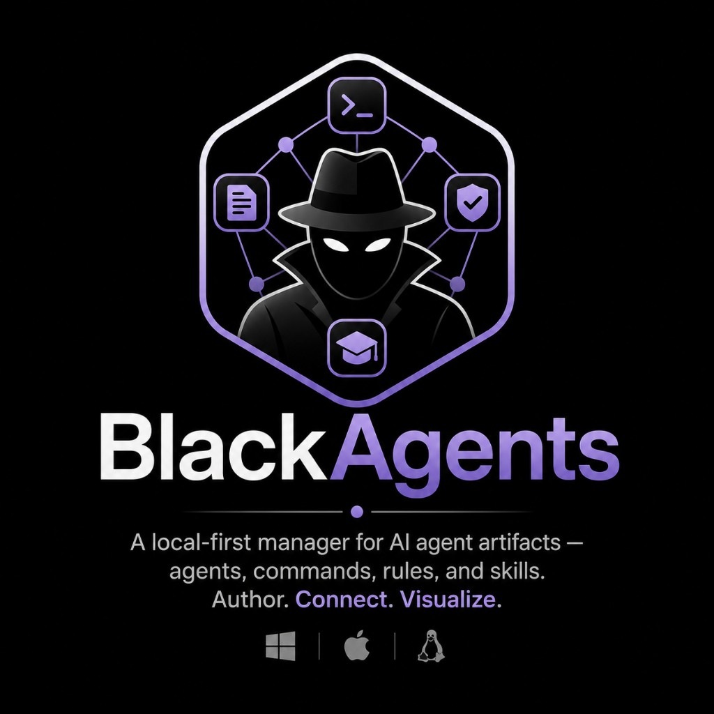

# BlackAgents

<div align="center">
  

  [](https://nextjs.org/)
  [](https://reactjs.org/)
  [](https://www.typescriptlang.org/)
  [](https://tailwindcss.com/)
  [](#)
</div>

---

A **local-first** manager for AI agent artifacts — **agents, commands, rules, and skills** — with a graphical UI. BlackAgents reads and writes the real `.md` / `.mdc` files in a project folder on your machine, uses an editable **authoring-standards** baseline to guide creation, and visualizes how artifacts reference each other in an Obsidian-style relationship graph.

## Features

- **Workspace Studio & Domain Templates** — create fresh workspaces from scratch with built-in starter kits (**Crypto Assets Hub**, **Software Engineering**, or **Blank**), or open existing project folders on disk.
- **Artifact CRUD** — create, edit, rename, and delete agents, commands, rules, and skills with a Markdown editor (live preview) and type-aware frontmatter fields.
- **Authoring standards** — an editable, per-workspace standards baseline that drives inline hints (required sections, anti-patterns) as you write.
- **Guided wizard** — a Type → Details → Body → Review flow for creating artifacts.
- **Relationship graph** — an Obsidian-style force-directed graph of the cross-references between artifacts.
- **Multi-platform export** — re-emit a workspace's artifacts in another platform's layout (`.cursor` / `.claude` / `.windsurf`) with a per-file diff (create / overwrite / unchanged), a cross-repo target folder, and a `.zip` download.
- **Drift / sync view** — a read-only, per-platform report of which on-disk files are in-sync, drifted, or missing (semantic comparison, so cosmetic re-serialization isn't flagged).
- **Chat with Agent Personas** — interact directly with any agent in your active workspace (e.g., chat with your `portfolio-rebalancer` or `feature-developer` agent) running with its specific persona, rules, and workflows.
- **Model Context Protocol (MCP) Integration** — configure standard `.cursor/mcp.json` servers (stdio commands or remote SSE endpoints) per workspace in **Settings → MCP Servers**. Agents autonomously invoke live tools during chat conversations with visual execution traces (tool name, server, duration, arguments, results/errors).
- **Assistant drafting (bring your own key)** — describe an artifact in plain language and the assistant proposes a standards-compliant draft you can open straight in the editor. Keys are stored locally (`0600`) and never leave your machine.

## Concepts

| Type | Purpose | File |
| --- | --- | --- |
| **Command** | Orchestration layer — sequences agents. | `.cursor/commands/<name>.md` |
| **Agent** | Single-responsibility worker with a persona. | `.cursor/agents/<name>.md` |
| **Rule** | Short declarative guardrail (auto/glob applied). | `.cursor/rules/<name>.mdc` |
| **Skill** | Deep reference package with supporting files. | `.cursor/skills/<name>/SKILL.md` |

Cross-references between artifacts (a command invoking an agent, an agent reading a skill, etc.) are detected automatically and rendered as a graph.

The internal model is platform-agnostic, so the same artifacts can be exported to other tools' layouts:

| Platform | Root | Notes |
| --- | --- | --- |
| **Cursor** | `.cursor/` | Source of truth; rules use `.mdc` + `alwaysApply` / `globs`. |
| **Claude** | `.claude/` | Keeps `name` + `description`; no rule-activation keys. |
| **Windsurf** | `.windsurf/` | Maps rule activation onto `trigger`; commands become workflows. |

## Tech stack

- **Next.js 16** (App Router) + **React 19** + **TypeScript**
- **Model Context Protocol (MCP)**: `@modelcontextprotocol/sdk` (stdio and SSE client transports)
- **Tailwind CSS 3.4** + **shadcn/ui** (Radix + CVA) + **next-themes**
- **gray-matter** + **fast-glob** for artifact parsing
- **react-force-graph-2d** for the relationship graph
- **CodeMirror** for the markdown body editor
- **zod** for input validation, **jszip** for the `.zip` export
- **Vitest** for unit and route integration testing
- Persistence: the local **filesystem** (your workspace). App settings live in `~/.black-agents/config.json`; LLM API keys live in `~/.black-agents/secrets.json` (written `0600`, never sent to the browser).

## Model Context Protocol (MCP)

BlackAgents provides first-class support for the **Model Context Protocol (MCP)**, allowing agents in any workspace to autonomously connect to external tools, databases, APIs, and execution environments.

### Standard Configuration (`.cursor/mcp.json`)

MCP servers are configured per-workspace in `.cursor/mcp.json`. This guarantees 100% interoperability with Cursor and Claude Desktop without proprietary config formats:

```json
{
  "mcpServers": {
    "sqlite-db": {
      "command": "uvx",
      "args": ["mcp-server-sqlite", "--db-path", "./data.db"],
      "env": {}
    },
    "market-feed": {
      "url": "https://mcp.example.com/sse",
      "transport": "sse"
    }
  }
}
```

### Key Capabilities

- **Transports**: Supports local command execution via `StdioClientTransport` (`npx`, `uvx`, `python`, `node`) and remote endpoints via `SSEClientTransport`.
- **Autonomous Tool Execution**: When chatting with an agent persona (e.g. `portfolio-rebalancer`), the agent discovers available tools from enabled servers and can autonomously invoke them in a bounded multi-turn execution loop (up to 5 turns).
- **Settings & Tool Diagnostics**: Navigate to **Settings → MCP Servers** to view live connection statuses (Connected / Error / Disabled), inspect tool signatures, test server responsiveness with timeout boundaries, or add new servers.
- **Visual Execution Traces**: In the Assistant chat, assistant responses display collapsible execution trace cards showing tool name, arguments, elapsed duration in milliseconds, and structured JSON results or errors.

## Workspace Starter Kits

When creating a new workspace in **Settings** or the header menu, you can start from scratch or choose a domain template:

- **Crypto Assets Hub (`crypto`)**:
  - `portfolio-rebalancer` agent — computes portfolio drift, target rebalancing, and DCA actions.
  - `risk-management.mdc` rule — enforces non-negotiable concentration limits (max 40% non-BTC/ETH, max 5% microcaps, 10% cash buffer).
  - `defi-lending-protocols` skill — guides health factor thresholds and borrow/supply rate mechanics (Aave, Morpho).
  - `weekly-portfolio-review` command — orchestrates weekly audits across wallets and agents.
  - `.cursor/mcp.json` — preconfigured MCP server for external market data tools.
- **Software Engineering (`software`)**:
  - `feature-developer` agent — plans, writes, and tests production code.
  - `typescript-strict.mdc` rule — enforces strict typing, error handling, and lint rules.
  - `testing-patterns` skill — testing strategies with Vitest and testing library.
- **Blank Workspace (`blank`)**:
  - Clean directory scaffold ready for custom agent setups.

## Getting started

```bash
npm install
npm run dev
```

Open <http://localhost:3000> to initialize a new workspace using a starter kit (like **Crypto Assets Hub** or **Software Engineering**) or open an existing project folder from your disk. You can switch or manage workspaces at any time from the header.

### Desktop app (Electron)

Run the Next.js development server inside an Electron window:

```bash
npm run desktop:dev
```

Build an unpacked desktop application for local testing:

```bash
npm run desktop:dir
```

Create distributable installers for the current operating system:

```bash
npm run desktop:pack
```

The packaged app starts a private Next.js standalone server on an available loopback port. It keeps the same local workspace and `~/.black-agents` configuration as the browser version. Distributables are written to `dist-electron/`. macOS packages are unsigned until signing credentials are configured.

### Using the chat assistant & agent personas

1. Go to **AI Providers** and configure credentials for **OpenAI**, **Anthropic**, or a **Custom** OpenAI-compatible endpoint (e.g. OpenRouter, or a local Ollama / LM Studio server). Keys are stored locally at `~/.black-agents/secrets.json` with `0600` permissions.
2. **Drafting New Artifacts**: Open **Assistant**, describe the artifact you want, and click **Open in editor** to review and save the generated draft.
3. **Chatting with Workspace Agents**: In **Assistant**, select an agent from the persona dropdown (e.g. `portfolio-rebalancer` or `feature-developer`). The assistant adopts that agent's specific persona, constraints, and workflow to solve problems or give advisory recommendations.
4. **Autonomous MCP Tools**: Configure MCP servers in **Settings → MCP Servers** (or edit `.cursor/mcp.json` directly). When you chat with an agent, any active tools are automatically discovered and can be called by the agent to fetch external data or run actions.

## Roadmap

- **Shipped:** Model Context Protocol (MCP) server integration & tool calling, workspace creation with domain starter kits (Crypto Assets Hub, Software Engineering, Blank), chat interaction with active agent personas, multiple workspaces, artifact CRUD, authoring-standards baseline, guided creation wizard, relationship graph, multi-platform export (diff + `.zip` + cross-repo target), drift/sync view, and bring-your-own-key assistant.
- **Next:** streaming chat responses, and multi-turn editing of existing artifacts in chat.

## Scripts

| Script | Description |
| --- | --- |
| `npm run dev` | Start the dev server |
| `npm run build` | Production build |
| `npm run start` | Serve the production build |
| `npm test` | Run all 30+ Vitest unit and integration test suites |
| `npm run desktop:dev` | Run the application in Electron during development |
| `npm run desktop:dir` | Build an unpacked desktop application |
| `npm run desktop:pack` | Build desktop installers for the current OS |
| `npm run lint` | Lint |
| `npm run type-check` | TypeScript check |
