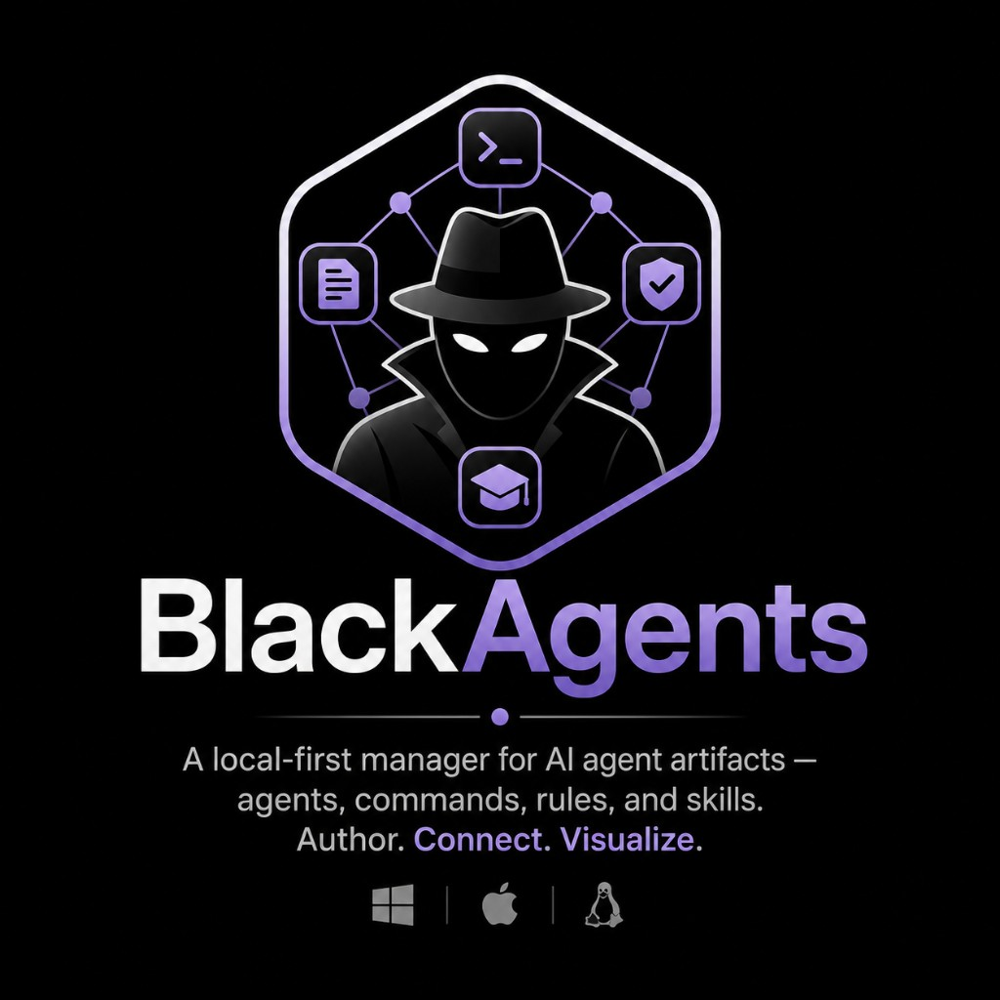

# BlackAgents

<div align="center">
  

  [](https://nextjs.org/)
  [](https://reactjs.org/)
  [](https://www.typescriptlang.org/)
  [](https://tailwindcss.com/)
  [](#)
</div>

---

A **local-first** manager for AI agent artifacts — **agents, commands, rules, and skills** — with a graphical UI. BlackAgents reads and writes the real `.md` / `.mdc` files in a project folder on your machine, uses an editable **authoring-standards** baseline to guide creation, and visualizes how artifacts reference each other in an Obsidian-style relationship graph.

Agents can also **act** on that folder: they read files, call MCP tools, and — only after you approve — write files or run commands. You can line agents up into **workflows**, and a **second brain** turns your feedback into notes you approve before they are saved.

## Features

- **Workspace Studio & Domain Templates** — create fresh workspaces from scratch with built-in starter kits (**Crypto Assets Hub**, **Software Engineering**, or **Blank**), or open existing project folders on disk.
- **Artifact CRUD** — create, edit, rename, and delete agents, commands, rules, and skills with a Markdown editor (live preview) and type-aware frontmatter fields.
- **`@` mentions** — type `@` in a body to pick another artifact by type. On save, the token becomes the markdown link the graph understands.
- **Authoring standards** — an editable, per-workspace standards baseline that drives inline hints (required sections, anti-patterns) as you write.
- **Guided wizard** — a Type → Details → Body → Review flow for creating artifacts.
- **Draft and review in the editor** — **Draft with assistant** writes a new body from the name and description. **Validate with assistant** reviews a draft or an existing artifact against the standards and lists findings. It does not rewrite the file.
- **Relationship graph** — an Obsidian-style force-directed graph of the cross-references between artifacts.
- **Multi-platform export** — re-emit a workspace's artifacts in another platform's layout (`.cursor` / `.claude` / `.windsurf` / `.agents`) with a per-file diff (create / overwrite / unchanged), a cross-repo target folder, and a `.zip` download.
- **Drift / sync view** — a read-only, per-platform report of which on-disk files are in-sync, drifted, or missing (semantic comparison, so cosmetic re-serialization isn't flagged).
- **Chat with agent personas** — talk to any agent in the active workspace. It runs with that agent's persona, linked skills and rules, and memory notes.
- **Agent tools and approvals** — agents can list and read workspace files, write files, run a command, and call MCP tools. Writes and commands wait on an approval card. **Allow file writes** skips the write prompt for that message. Commands still ask.
- **Artifact bundles** — ask the assistant for a team and it proposes one agent plus up to three skills and three rules. **Create all** saves them after a standards check.
- **Workflows** — a local production line. Each step runs one workspace agent and passes its result to the next. Run by hand, on an interval, or daily while the app is open.
- **Second brain** — thumbs up or down on a chat reply or a finished run. BlackAgents may draft a memory note, skill, or rule. Nothing is saved until you approve it on **Brain**.
- **Jev (optional)** — a fast classifier for small choices: which artifact to load, whether a workflow step should continue, whether a scheduled run is needed, and what is worth learning. The app still works with Jev off.
- **Model Context Protocol (MCP)** — configure standard `.cursor/mcp.json` servers (stdio commands or remote SSE endpoints) per workspace in **Settings → MCP Servers**. Each server is trusted, ask, or risky. Chat shows a trace for every tool call.
- **Assistant drafting (bring your own key)** — describe an artifact in plain language and the assistant proposes a standards-compliant draft you can open straight in the editor. Keys are stored locally (`0600`) and never leave your machine.

## Concepts

| Type | Purpose | File |
| --- | --- | --- |
| **Command** | Orchestration layer — sequences agents. | `.cursor/commands/<name>.md` |
| **Agent** | Single-responsibility worker with a persona. | `.cursor/agents/<name>.md` |
| **Rule** | Short declarative guardrail (auto/glob applied). | `.cursor/rules/<name>.mdc` |
| **Skill** | Deep reference package with supporting files. | `.cursor/skills/<name>/SKILL.md` |

Cross-references between artifacts (a command invoking an agent, an agent reading a skill, etc.) are detected automatically and rendered as a graph.

The internal model is platform-agnostic, so the same artifacts can be exported to other tools' layouts:

| Platform | Root | Notes |
| --- | --- | --- |
| **Cursor** | `.cursor/` | Source of truth; rules use `.mdc` + `alwaysApply` / `globs`. |
| **Claude** | `.claude/` | Keeps `name` + `description`; no rule-activation keys. |
| **Windsurf** | `.windsurf/` | Maps rule activation onto `trigger`; commands become workflows. |
| **Antigravity** | `.agents/` | Keeps `name` + `description`; rules keep `alwaysApply` / `globs`; commands become workflows. |

## Tech stack

- **Next.js 16** (App Router) + **React 19** + **TypeScript**
- **Model Context Protocol (MCP)**: `@modelcontextprotocol/sdk` (stdio and SSE client transports)
- **Jev** (optional): `@typesafe-ai/sdk`, used only by the decision layer
- **Electron** for the desktop shell
- **Tailwind CSS 3.4** + **shadcn/ui** (Radix + CVA) + **next-themes**
- **gray-matter** + **fast-glob** for artifact parsing
- **react-force-graph-2d** for the relationship graph
- **CodeMirror** for the markdown body editor
- **zod** for input validation, **jszip** for the `.zip` export
- **Vitest** for unit and route integration tests, **Playwright** for end-to-end flows
- Persistence: the local **filesystem** (your workspace). App settings live in `~/.black-agents/` (`config.json`, `settings.json`, and `secrets.json` for keys, written `0600`). Per-workspace workflows, brain notes, and MCP trust live in `<workspace>/.black-agents/`.

## Model Context Protocol (MCP)

BlackAgents provides first-class support for the **Model Context Protocol (MCP)**, allowing agents in any workspace to autonomously connect to external tools, databases, APIs, and execution environments.

### Standard Configuration (`.cursor/mcp.json`)

MCP servers are configured per-workspace in `.cursor/mcp.json`. This guarantees 100% interoperability with Cursor and Claude Desktop without proprietary config formats:

```json
{
  "mcpServers": {
    "sqlite-db": {
      "command": "uvx",
      "args": ["mcp-server-sqlite", "--db-path", "./data.db"],
      "env": {}
    },
    "market-feed": {
      "url": "https://mcp.example.com/sse",
      "transport": "sse"
    }
  }
}
```

### Key Capabilities

- **Transports**: Supports local command execution via `StdioClientTransport` (`npx`, `uvx`, `python`, `node`) and remote endpoints via `SSEClientTransport`.
- **Autonomous Tool Execution**: When chatting with an agent persona (e.g. `portfolio-rebalancer`), the agent discovers available tools from enabled servers and can call them inside a bounded loop (8 turns by default, up to 20 in **Settings → AI**).
- **Trust**: each server is `trusted` (treated as a read), `ask` (needs approval, the default), or `risky` (needs approval every time). The choice is stored in `.black-agents/mcp-policy.json`.
- **Settings & Tool Diagnostics**: Navigate to **Settings → MCP Servers** to view live connection statuses (Connected / Error / Disabled), inspect tool signatures, test server responsiveness with timeout boundaries, or add new servers.
- **Visual Execution Traces**: In the Assistant chat, assistant responses display collapsible execution trace cards showing tool name, arguments, elapsed duration in milliseconds, and structured JSON results or errors.

## Workspace Starter Kits

When creating a new workspace in **Settings** or the header menu, you can start from scratch or choose a domain template:

- **Crypto Assets Hub (`crypto`)**:
  - `portfolio-rebalancer` agent — computes portfolio drift, target rebalancing, and DCA actions.
  - `risk-management.mdc` rule — enforces non-negotiable concentration limits (max 40% non-BTC/ETH, max 5% microcaps, 10% cash buffer).
  - `defi-lending-protocols` skill — guides health factor thresholds and borrow/supply rate mechanics (Aave, Morpho).
  - `weekly-portfolio-review` command — orchestrates weekly audits across wallets and agents.
  - `.cursor/mcp.json` — preconfigured MCP server for external market data tools.
- **Software Engineering (`software`)**:
  - `feature-developer` agent — plans, writes, and tests production code.
  - `typescript-strict.mdc` rule — enforces strict typing, error handling, and lint rules.
  - `testing-patterns` skill — testing strategies with Vitest and testing library.
- **Blank Workspace (`blank`)**:
  - Clean directory scaffold ready for custom agent setups.

## Getting started

```bash
npm install
npm run dev
```

Open <http://localhost:3000> to initialize a new workspace using a starter kit (like **Crypto Assets Hub** or **Software Engineering**) or open an existing project folder from your disk. You can switch or manage workspaces at any time from the header.

### Desktop app (Electron)

Run the Next.js development server inside an Electron window:

```bash
npm run desktop:dev
```

Build an unpacked desktop application for local testing:

```bash
npm run desktop:dir
```

Create distributable installers for the current operating system:

```bash
npm run desktop:pack
```

The packaged app starts a private Next.js standalone server on an available loopback port. It keeps the same local workspace and `~/.black-agents` configuration as the browser version. Distributables are written to `dist-electron/`. macOS packages are unsigned until signing credentials are configured.

Minimizing the window hides it and leaves a menu-bar icon. Click the icon to open the window again. Right-click it for **Open** and **Quit**. The app stays in the Dock. The red close button still closes the window.

### Using the chat assistant & agent personas

1. Go to **AI Providers** and configure credentials for **OpenAI**, **Anthropic**, or a **Custom** OpenAI-compatible endpoint (e.g. OpenRouter, or a local Ollama / LM Studio server). Keys are stored locally at `~/.black-agents/secrets.json` with `0600` permissions.
2. **Drafting new artifacts**: Open **Assistant**, describe the artifact you want, and click **Open in editor** to review and save the generated draft. Ask for a team to get a bundle, then **Create all**.
3. **Chatting with workspace agents**: In **Assistant**, select an agent from the persona dropdown (e.g. `portfolio-rebalancer` or `feature-developer`). Type `@` to pick an artifact from the workspace. The chat loads it into the turn and shows it as a **Context** badge. `/name` also works when that name belongs to only one artifact.
4. **Approvals**: a write or a command shows a card. Approve or deny it. You can remember one exact command for that message. **Allow file writes** auto-approves writes for the current message only.
5. **MCP tools**: Configure MCP servers in **Settings → MCP Servers** (or edit `.cursor/mcp.json` directly) and set each server's trust. Active tools are discovered when you chat.
6. **Workflows**: open **Workflows**, add steps that point at workspace agents, then run the line. A live run page shows each step, waiting approvals, and files changed. Interval and daily runs fire only while the app is open.
7. **Brain**: rate a reply or a finished run. Open **Brain** to approve or reject the proposed note, skill, or rule. Approved notes are added to later chats with that agent.
8. **Jev** (optional): in **Settings → AI**, turn on **Use Jev**, pick a provider, and run **Test Jev**. With it off, chat, workflows, and learning still run.

## Roadmap

Shipped:

- Artifact CRUD, authoring standards, guided wizard, `@` mentions, and the relationship graph
- Multi-platform export (diff, `.zip`, cross-repo target) and the drift / sync view
- Bring-your-own-key assistant, in-editor draft and standards review, agent personas, and artifact bundles
- Agent tool loop with approvals, MCP trust, workflows, second brain, and optional Jev
- Workspace starter kits and the Electron desktop app

Still open:

- Token-by-token streaming (chat already streams each model turn over SSE)
- Choosing the default provider and model in the UI
- **Draft with assistant** inside the wizard and while editing an existing artifact
- Two-way sync that can import artifacts which exist only in `.claude`
- Scheduled workflows while the app is closed
- Approvals that survive a restart
- Parallel steps inside one workflow

## Scripts

| Script | Description |
| --- | --- |
| `npm run dev` | Start the dev server |
| `npm run build` | Production build |
| `npm run start` | Serve the production build |
| `npm test` | Vitest unit and integration tests |
| `npm run test:watch` | Vitest in watch mode |
| `npm run test:cov` | Vitest with coverage for `lib/` |
| `npm run test:e2e` | Playwright end-to-end tests |
| `npm run desktop:dev` | Run the application in Electron during development |
| `npm run desktop:dir` | Build an unpacked desktop application |
| `npm run desktop:pack` | Build desktop installers for the current OS |
| `npm run lint` | Lint |
| `npm run type-check` | TypeScript check |

## Desktop releases

A version tag builds the desktop app and publishes the installers on [GitHub Releases](https://github.com/cristoferdomingues/BlackAgents/releases).

1. Set the same version in `package.json` and `electron/package.json`.
2. Commit that change.
3. Tag and push it:

```bash
git tag v0.1.0
git push origin v0.1.0
```

The workflow publishes:

| System | File |
| --- | --- |
| macOS (Apple Silicon) | `.dmg` and `.zip` |
| Windows (64-bit) | installer `.exe` |
| Linux (64-bit) | `.AppImage` |

These builds are not code-signed yet. macOS and Windows show a warning the first time you open the app. The release notes explain how to continue.

## License

[MIT](LICENSE) © 2026 Cristofer Domingues
